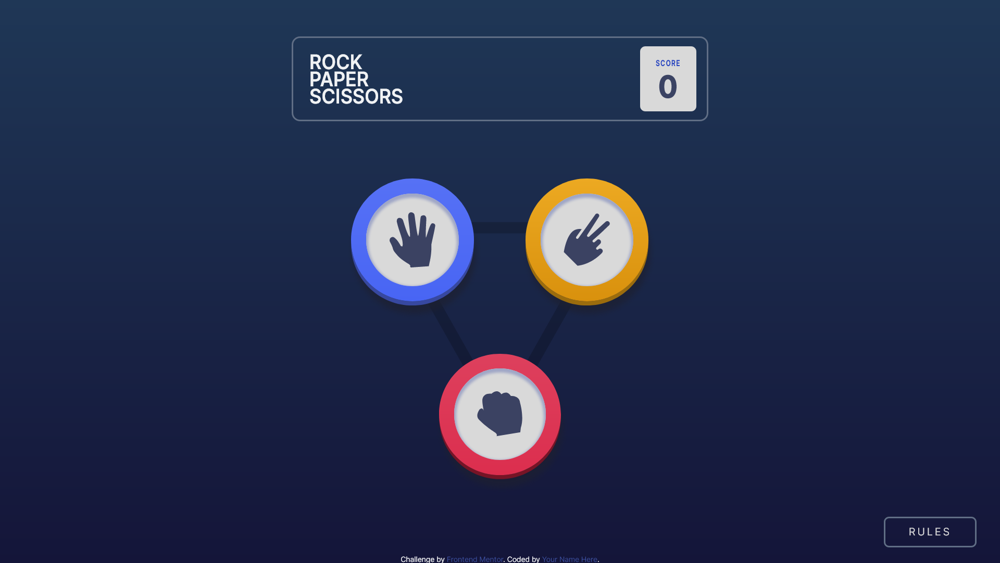
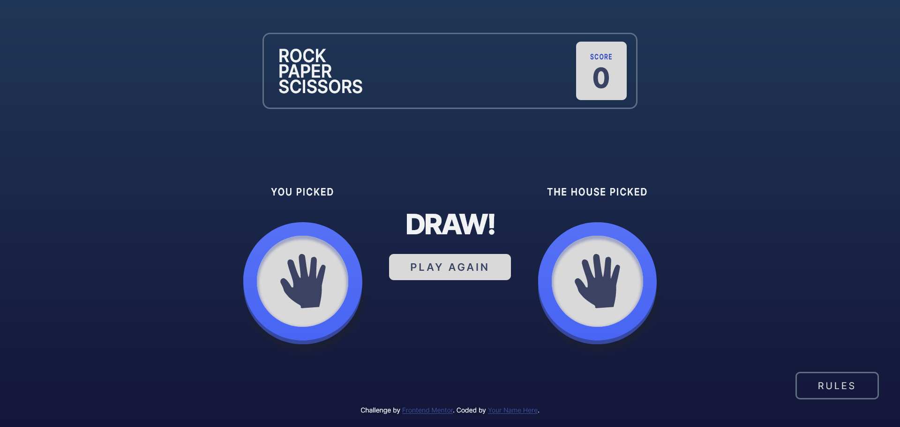
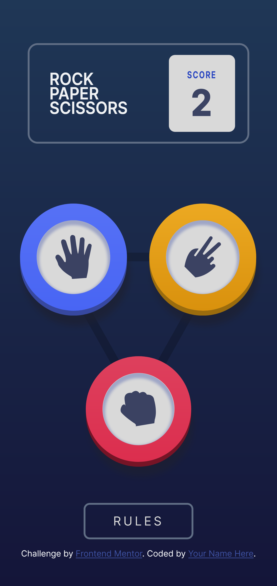
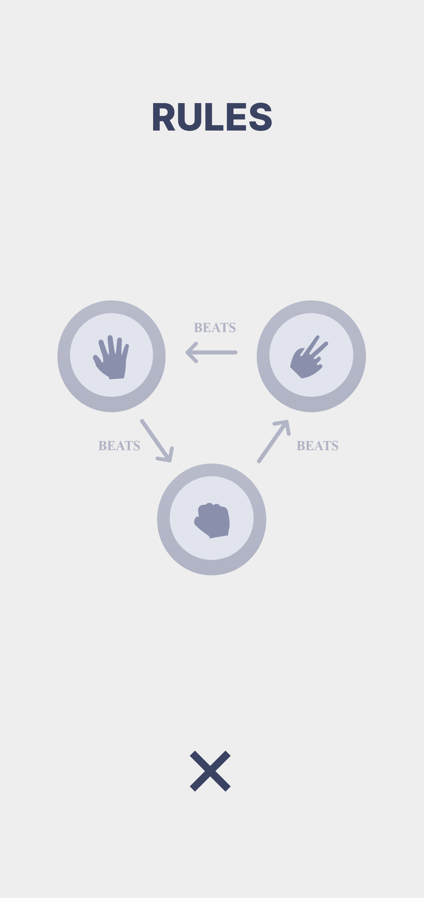
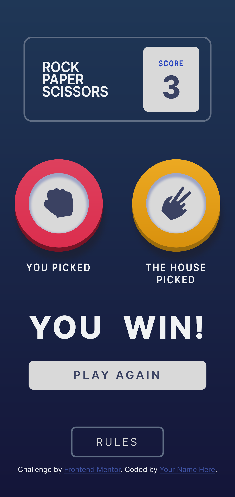
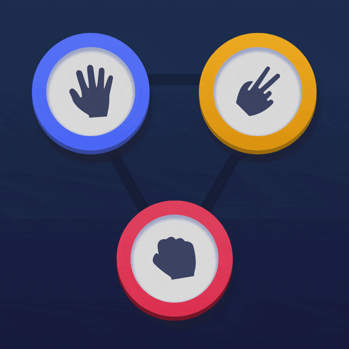

# Frontend Mentor - Rock, Paper, Scissors solution

This is a solution to the [Rock, Paper, Scissors challenge on Frontend Mentor](https://www.frontendmentor.io/challenges/rock-paper-scissors-game-pTgwgvgH). Frontend Mentor challenges help you improve your coding skills by building realistic projects. 

## Table of contents

- [Overview](#overview)
  - [The challenge](#the-challenge)
  - [Screenshot](#screenshot)
  - [Links](#links)
- [My process](#my-process)
  - [Built with](#built-with)
  - [What I learned](#what-i-learned)
  - [Continued development](#continued-development)
- [Author](#author)
<!-- - [Acknowledgments](#acknowledgments) -->

## Overview

### The challenge

Users should be able to:

- View the optimal layout for the game depending on their device's screen size
- Play Rock, Paper, Scissors against the computer
- Maintain the state of the score after refreshing the browser

### Screenshot





<p float="left">
  
  
  
</p>

### Links

- Solution URL: [Github repo](https://github.com/zaticpetru/rock-paper-scissors)
- Live Site URL: [Rock Papaer Scissors](https://zaticpetru.github.io/rock-paper-scissors/)

## My process

### Built with

- Semantic HTML5 markup
- CSS custom properties
- Flexbox
- CSS Grid


### What I learned

Used 3 shadows to create the action circles with 3D effect.

HTML:
```html
      <div class="game-container">
        <div class="action-circle paper" data-action="paper">
          <div>
            
          </div>
        </div>
        ....
        <div class="action-circle scissors" data-action="scissors"> ... </div>
      </div>
```
CSS
```css
.action-circle {
  ...
  box-shadow:
    /* 1 */
    0rem 0.4rem 0rem var(--custom--shadow-color, var(--light-shadow-color)),
    /* 2 */
    0.2rem 1.2rem 0.5rem var(--dark-shadow-color);
  ...
}

.action-circle div {
  ...
  /* 3 */
  box-shadow: inset 0rem 0.2em 0.2rem 0.2rem var(--light-shadow-color);
  ...
}

.paper {
  grid-area: paper;
  --custom-gradient: var(--paper-gradient);
  --custom--shadow-color: hsl(230, 49%, 42%);
}
```

To create the effect 3 shadows are used, 1 of them inset and 2 

1. Shadow used to create a darker shade of material on the bottom of the circle.


2. General dark shadow for the whole element.

3. Inset shadow to create a ilustion that the border is higher then the inside of the circle.


### Continued development

- Will improve animations
- Implement bonus version of the game: Play Rock, Paper, Scissors, Lizard, Spock against the computer 


## Author

- Frontend Mentor - [@zaticpetru](https://www.frontendmentor.io/profile/zaticpetru)
- Linkedin - [petru-zatic](https://www.linkedin.com/in/petru-zatic/)

<!-- ## Acknowledgments

This is where you can give a hat tip to anyone who helped you out on this project. Perhaps you worked in a team or got some inspiration from someone else's solution. This is the perfect place to give them some credit. -->
